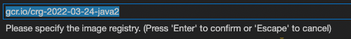

# InnerLoop Development with Java - SpringBoot

# Overview

This lab demonstrates features and capabilities designed to streamline the development workflow for software engineers tasked with developing Java applications in a containerized environment. Typical container development requires the user to understand details of containers and the container build process. Additionally, developers typically have to break their flow, moving out of their IDE to test and debug their applications in remote environments. With the tools and technologies mentioned in this tutorial, developers can work effectively with containerized applications without leaving their IDE. 


## What you will learn

In this lab you will learn methods for developing with containers in GCP including: 
* Creating a new Java starter application
* Configuring the app for container development
* Creating a simple CRUD Rest Service
* Deploying to GKE
* Utilizing breakpoint / logs
* Hot deploying changes back to GKE


# Before you begin

For this reference guide, you need a Google Cloud [project](https://cloud.google.com/resource-manager/docs/cloud-platform-resource-hierarchy#projects). You can create a new one, or select a project you already created:


1. Select or create a Google Cloud project.

    [GO TO THE PROJECT SELECTOR PAGE](https://console.corp.google.com/projectselector2/home/dashboard)

2. Enable billing for your project.

    [ENABLE BILLING](https://support.google.com/cloud/answer/6293499#enable-billing)


# Utilizing Cloudshell Editor

This lab was designed and tested for use with Google Cloud Shell Editor. To access the editor: 

1. access your google project at [https://console.cloud.google.com](https://console.cloud.google.com). 
2. In the top right corner click on the cloud shell editor icon 

   

3. A new pane will open in the bottom of your window
4. Click on the Open Editor button

   

5. The editor will open with an explorer on the right and editor in the central area
6. A terminal pane should also be available in the bottom of the screen
7. If the terminal is NOT open use the key combination of ctrl+` to open a new terminal window


# Preparing your environment

1. Create environment variables to use throughout this tutorial:

    ```shell
    export PROJECT_ID=$(gcloud config get-value project)
    export PROJECT_NUMBER=$(gcloud projects describe $PROJECT_ID --format='value(projectNumber)')
    ```
2. In Cloud Shell, clone the project files and change into the directory
    ```shell
    git clone https://github.com/ddobrin/container-developer-workshop.git
    
    cd container-developer-workshop/labs/spring-boot
    ```
3. Provision the infrastructure used in this lab
    ```shell
    ./setup.sh
    ```

# Creating a new Java starter application

In this section you’ll create a new Java Spring Boot application from scratch utilizing a sample application provided by spring.io

## Clone the Sample Application
1. Create a starter application
    ```shell
    curl  https://start.spring.io/starter.zip -d dependencies=web -d type=maven-project -d javaVersion=11 -d packageName=com.example.springboot -o sample-app.zip
    ```
2. Unzip the application
`unzip sample-app.zip -d sample-app`
3. Change into the sample-app directory and open the folder in the Cloud Shell IDE workspace
    ```shell
    cd sample-app && cloudshell workspace .
    ```

## Add spring-boot-devtools & Jib

To enable the Spring Boot DevTools find and open the pom.xml from the explorer in your editor. Next paste the following code after the description line which reads &lt;description>Demo project for Spring Boot&lt;/description> 

1. Add spring-boot-devtools  in pom.xml

    Open the pom.xml in the root of the project. Add the following configuration after the `Description` entry.

    ```xml
      <!--  Spring profiles-->
      <profiles>
          <profile>
          <id>sync</id>
          <dependencies>
              <dependency>
              <groupId>org.springframework.boot</groupId>
              <artifactId>spring-boot-devtools</artifactId>
              </dependency>
          </dependencies>
          </profile>
      </profiles>
    ```

    Choose `Now` when prompted about build file change.
2. Enable jib-maven-plugin in pom.xml

    Jib is an open-source Java containerizer from Google that lets Java developers build containers using the Java tools they know. Jib is a fast and simple container image builder that handles all the steps of packaging your application into a container image. It does not require you to write a Dockerfile or have docker installed, and it is directly integrated into Maven and Gradle.


    Scroll down in the pom.xml file and update the `Build `section to include the Jib plugin. The build section should match the following when completed. 

    ```xml
      <build>
        <plugins>
          <plugin>
            <groupId>org.springframework.boot</groupId>
            <artifactId>spring-boot-maven-plugin</artifactId>
          </plugin>
          <!--  Jib Plugin-->
          <plugin>
            <groupId>com.google.cloud.tools</groupId>
            <artifactId>jib-maven-plugin</artifactId>
            <version>3.2.0</version>
          </plugin>
        </plugins>
      </build>
    ```

    Choose `Now` when prompted about build file change.


## Generate Manifests

Skaffold provides integrated tools to simplify container development.  In this step you will initialize skaffold which will automatically create base kubernetes YAML files. Execute the command below to begin the process. 

1. Execute the following command in the terminal
    ```shell
    skaffold init --generate-manifests --XXenableJibInit
    ```
2. When prompted:
    * Use the arrows to move your cursor to **<code>Jib Maven Plugin</code></strong>
    * Press the spacebar to select the option.
    * Press enter to continue 
3. Enter <strong>8080</strong> for the port
4. Enter <strong>y</strong> to save the configuration

Two files are added to the workspace viz, <code>skaffold.yaml</code>and <code>deployment.yaml</code>

## Update app name

The default values included in the configuration don’t currently match the name of your application. Update the files to reference your application name rather than the default values.

1. Change entries in Skaffold config
    * Open `skaffold.yaml`
    * Select the image name currently set as `pom-xml-image`
    * Right click and choose Change All Occurrences
    * Type in the new name as `demo-app`
2. Change entries in Kubernetes config
    * Open `deployment.yaml` file 
    * Select the image name currently set as` pom-xml-image`
    * Right click and choose Change All Occurrences
    * Type in the new name as `demo-app`


## Enable hot sync

To facilitate an optimized hot reload experience you’ll utilize the Sync feature provided by Jib. In this step you will configure Skaffold to utilize that feature in the build process. 


1. Update skaffold config

    In the skaffold.yaml file replace the entire build section of the file with the following specification. Do not alter other sections of the file. 

    ```yaml
    build:
      artifacts:
      - image: demo-app
        jib:
          project: com.example:demo
          type: maven
          args: 
          - --no-transfer-progress
          - -Psync
          fromImage: gcr.io/distroless/java:debug
        sync:
          auto: true
    ```

## Add a default route

Create a file called HelloController.java in <strong>/src/main/java/com/example/springboot/</strong>

Paste the following contents in the file to create a default http route.
```java
package com.example.springboot;

import org.springframework.web.bind.annotation.GetMapping;
import org.springframework.web.bind.annotation.RestController;
import org.springframework.beans.factory.annotation.Value;

@RestController
public class HelloController {

    @Value("${target:local}")
    String target;

    @GetMapping("/") 
    public String hello()
    {
        return String.format("Hello from your %s environment!", target);
    }
}
```

# Walking through the development process

In this section you’ll walk through a few steps using the Cloud Code plugin to learn the basic processes and to validate the configuration and setup of your starter application. 

Cloud Code integrates with skaffold to streamline your development process. When you deploy to GKE in the following steps, Cloud Code and Skaffold will automatically build your container image, push it to a Container Registry, and then deploy your application to GKE. This happens behind the scenes abstracting the details away from the developer flow. Cloud Code also enhances your development process by providing traditional debug and hotsync capabilities to container based development. 


## Deploy to Kubernetes
1. In the pane at the bottom of Cloud Shell Editor, select Cloud Code     

   

2. In the panel that appears at the top, select Debug on Kubernetes. If prompted, select Yes to use the current Kubernetes context.

   

3. The first time you run the command a  prompt will appear at the top of the screen asking if you want to you the current kubernetes context, select “Yes” to accept and use the current context. 

   

4. Next a prompt will be displayed asking which container registry to use. Press enter to accept the default value provided

   


5. A new tab will appear in your editor that contains the configurations for your build. Scroll to the bottom leaving all the defaults. Then Click the `Debug` button.

   


6. Select the Output tab in the lower pane  to view progress and notifications

   


7. Select "Kubernetes: Run/Debug - Detailed" in the channel drop down to the right to view additional details and logs streaming live from the containers

   

8. Return to the simplified view by selecting “Kubernetes: Run/Debug” from the dropdown
9. When the build and tests are done, the Output tab says: `Resource deployment/demo-app status completed successfully`, and a url is listed: “Forwarded URL from service demo-app: http://localhost:8080”
10. In the Cloud Code terminal, hover over the URL in the output (http://localhost:8080), and then in the tool tip that appears select Open Web Preview. 

    The response will be:
    ```
    Hello from your local environment!
    ```

## Utilize Breakpoints

1. Open the HelloController.java application located at `/src/main/java/com/example/springboot/HelloController.java`
2. Locate the return statement for the root path which reads `return String.format("Hello from your %s environment!", target);`
3. Add a breakpoint to that line by clicking the blank space to the left of the line number. A red indicator will show to note the breakpoint is set
4. Reload your browser and note the debugger stops the process at the breakpoint and allows you to investigate the variable sand state of the application which is running remotely in GKE
5. Click down into the variables section until you find the “Target” variable. 
6. Observe the current value as “local”
7. Double click on the variable name “target” and in the popup, change the value to something different like “Cloud”
8. Click the Continue button in the debug control panel
9. Review the response in your browser which now shows the updated value you just entered.

## Hot Reload
1. Change the statement to return a different value such as “Hello from Cloud Code”
2. The file is automatically saved and synced into the remote containers in GKE
3. Refresh your browser to see the updated results. 

# Developing a simple CRUD Rest Service

At this point your application is fully configured for containerized development and you’ve walked through the basic development workflow with Cloud Code. In the following sections you practice what you’ve learned by adding rest service endpoints connecting to a managed database in Google Cloud.

## Configure Dependencies

The application code utilizes a database to persist the rest service data. Ensure the dependencies are available by adding the following in the pom.xl

1. Open the `pom.xml` file and add the following into the dependencies section of the config

```xml
    <!--  Database dependencies-->
    <dependency>
      <groupId>org.springframework.boot</groupId>
      <artifactId>spring-boot-starter-data-jpa</artifactId>
    </dependency>
    <dependency>
      <groupId>com.h2database</groupId>
      <artifactId>h2</artifactId>
      <scope>runtime</scope>
    </dependency>
    <dependency>
      <groupId>org.postgresql</groupId>
      <artifactId>postgresql</artifactId>
      <scope>runtime</scope>
    </dependency>
    <dependency>
      <groupId>org.flywaydb</groupId>
      <artifactId>flyway-core</artifactId>
    </dependency>
```

## Code the REST service

**Quote.java**

Create a file called Quote.java in `/src/main/java/com/example/springboot/` and copy in the code below. This defines the Entity model for the Quote object used in the application.

```java
package com.example.springboot;

import javax.persistence.Column;
import javax.persistence.Entity;
import javax.persistence.Id;
import javax.persistence.Table;
import java.util.Objects;

@Entity
@Table(name = "quotes")
public class Quote
{
    @Id
    @Column(name = "id")
    private Integer id;

    @Column(name="quote")
    private String quote;

    @Column(name="author")
    private String author;

    public Integer getId() {
        return id;
    }

    public void setId(Integer id) {
        this.id = id;
    }

    public String getQuote() {
        return quote;
    }

    public void setQuote(String quote) {
        this.quote = quote;
    }

    public String getAuthor() {
        return author;
    }

    public void setAuthor(String author) {
        this.author = author;
    }

    @Override
    public boolean equals(Object o) {
      if (this == o) {
        return true;
      }
      if (o == null || getClass() != o.getClass()) {
        return false;
      }
        Quote quote1 = (Quote) o;
        return Objects.equals(id, quote1.id) &&
                Objects.equals(quote, quote1.quote) &&
                Objects.equals(author, quote1.author);
    }

    @Override
    public int hashCode() {
        return Objects.hash(id, quote, author);
    }
}
```

**QuoteRepository.java**

Create a file called  QuoteRepository.java  at src/main/java/com/example/springboot and copy in the following code

```java
package com.example.springboot;

import org.springframework.data.jpa.repository.JpaRepository;
import org.springframework.data.jpa.repository.Query;

public interface QuoteRepository extends JpaRepository<Quote,Integer> {

    @Query( nativeQuery = true, value =
            "SELECT id,quote,author FROM quotes ORDER BY RANDOM() LIMIT 1")
    Quote findRandomQuote();
}
```

This code uses JPA for persisting the data. The class extends the Spring `JPARepository` interface and allows the creation of custom code. In the code you’ve added a `findRandomQuote` custom method.

**QuoteController.java**

To expose the endpoint for the service, a `QuoteController` class will provide this functionality. 

Create a file called QuoteController.java at `src/main/java/com/example/springboot` and copy in the following contents

```java
package com.example.springboot;

import java.util.ArrayList;
import java.util.List;
import java.util.Optional;

import org.springframework.dao.EmptyResultDataAccessException;
import org.springframework.http.HttpStatus;
import org.springframework.http.ResponseEntity;
import org.springframework.web.bind.annotation.DeleteMapping;
import org.springframework.web.bind.annotation.GetMapping;
import org.springframework.web.bind.annotation.PathVariable;
import org.springframework.web.bind.annotation.PostMapping;
import org.springframework.web.bind.annotation.PutMapping;
import org.springframework.web.bind.annotation.RequestBody;
import org.springframework.web.bind.annotation.RestController;

@RestController
public class QuoteController {

    private final QuoteRepository quoteRepository;

    public QuoteController(QuoteRepository quoteRepository) {
        this.quoteRepository = quoteRepository;
    }

    @GetMapping("/random-quote") 
    public Quote randomQuote()
    {
        return quoteRepository.findRandomQuote();  
    }

    @GetMapping("/quotes") 
    public ResponseEntity<List<Quote>> allQuotes()
    {
        try {
            List<Quote> quotes = new ArrayList<Quote>();


            quoteRepository.findAll().forEach(quotes::add);

            if (quotes.size()==0 || quotes.isEmpty()) 
                return new ResponseEntity<List<Quote>>(HttpStatus.NO_CONTENT);


            return new ResponseEntity<List<Quote>>(quotes, HttpStatus.OK);
        } catch (Exception e) {
            System.out.println(e.getMessage());
            return new ResponseEntity<List<Quote>>(HttpStatus.INTERNAL_SERVER_ERROR);
        }        
    }

    @PostMapping("/quotes")
    public ResponseEntity<Quote> createQuote(@RequestBody Quote quote) {
        try {
            Quote saved = quoteRepository.save(quote);
            return new ResponseEntity<Quote>(saved, HttpStatus.CREATED);
        } catch (Exception e) {
            System.out.println(e.getMessage());
            return new ResponseEntity<Quote>(HttpStatus.INTERNAL_SERVER_ERROR);
        }
    }     

    @PutMapping("/quotes/{id}")
    public ResponseEntity<Quote> updateQuote(@PathVariable("id") Integer id, @RequestBody Quote quote) {
        try {
            Optional<Quote> existingQuote = quoteRepository.findById(id);


            if(existingQuote.isPresent()){
                Quote updatedQuote = existingQuote.get();
                updatedQuote.setAuthor(quote.getAuthor());
                updatedQuote.setQuote(quote.getQuote());

                return new ResponseEntity<Quote>(updatedQuote, HttpStatus.OK);
            } else {
                return new ResponseEntity<Quote>(HttpStatus.NOT_FOUND);
            }
        } catch (Exception e) {
            System.out.println(e.getMessage());
            return new ResponseEntity<Quote>(HttpStatus.INTERNAL_SERVER_ERROR);
        }
    }     

    @DeleteMapping("/quotes/{id}")
    public ResponseEntity<HttpStatus> deleteQuote(@PathVariable("id") Integer id) {
        try {
            quoteRepository.deleteById(id);
            return new ResponseEntity<>(HttpStatus.NO_CONTENT);
        } catch (RuntimeException e) {
            System.out.println(e.getMessage());
            return new ResponseEntity<>(HttpStatus.INTERNAL_SERVER_ERROR);
        }
    }    
}
```

## Add Database Configurations

**application.yaml**

Add configuration for the backend database accessed by the service. Edit file called `application.yaml` file under` src/main/resources` and add a parameterized Spring configuration for the backend.

```yaml
spring:
  config:
    activate:
      on-profile: cloud-dev
  datasource:
    url: 'jdbc:postgresql://${DB_HOST:127.0.0.1}/${DB_DATABASE:quote_db}'
    username: '${DB_USER:user}'
    password: '${DB_PASS:password}'
  jpa:
    properties:
      hibernate:
        jdbc:
          lob:
            non_contextual_creation: true
        dialect: org.hibernate.dialect.PostgreSQLDialect
    hibernate:
      ddl-auto: update
```


**Add Database Migration**

Create a folder at src/main/resources/db/migration/

create a SQL file: `V1__create_quotes_table.sql 

Paste the following contents into the file


```sql
CREATE TABLE quotes(
   id INTEGER PRIMARY KEY,
   quote VARCHAR(1024),
   author VARCHAR(256)
);

INSERT INTO quotes (id,quote,author) VALUES (1,'Never, never, never give up','Winston Churchill');
INSERT INTO quotes (id,quote,author) VALUES (2,'While there''s life, there''s hope','Marcus Tullius Cicero');
INSERT INTO quotes (id,quote,author) VALUES (3,'Failure is success in progress','Anonymous');
INSERT INTO quotes (id,quote,author) VALUES (4,'Success demands singleness of purpose','Vincent Lombardi');
INSERT INTO quotes (id,quote,author) VALUES (5,'The shortest answer is doing','Lord Herbert');
```

**deployment.yaml**

The following additions to the `deployment.yaml` file allow the application to connect to the CloudSQL instances. 
* TARGET - configures the variable to indicate the environment where the app is executed
* SPRING_PROFILES_ACTIVE - shows the active Spring profile, which will be configured to `cloud-dev`
* DB_HOST - the private IP for the database, which has been noted when the database instance has been created or by clicking `SQL` in the Navigation Menu of the Google Cloud Console - please change the value !
* DB_USER and DB_PASS - as set in the CloudSQL instance configuration, stored as a Secret in GCP

Update your deployment.yaml with the contents below. 


```yaml
apiVersion: v1
kind: Service
metadata:
  name: demo-app
  labels:
    app: demo-app
spec:
  ports:
  - port: 8080
    protocol: TCP
  clusterIP: None
  selector:
    app: demo-app
---
apiVersion: apps/v1
kind: Deployment
metadata:
  name: demo-app
  labels:
    app: demo-app
spec:
  replicas: 1
  selector:
    matchLabels:
      app: demo-app
  template:
    metadata:
      labels:
        app: demo-app
    spec:
      containers:
      - name: demo-app
        image: demo-app
        env:
          - name: PORT
            value: "8080"
          - name: TARGET
            value: "Local Dev - CloudSQL Database - K8s Cluster"
          - name: SPRING_PROFILES_ACTIVE
            value: cloud-dev
          - name: DB_HOST
            value: ${DB_INSTANCE_IP}   
          - name: DB_PORT
            value: "5432"  
          - name: DB_USER
            valueFrom:
              secretKeyRef:
                name: gke-cloud-sql-secrets
                key: username
          - name: DB_PASS
            valueFrom:
              secretKeyRef:
                name: gke-cloud-sql-secrets
                key: password
          - name: DB_NAME
            valueFrom:
              secretKeyRef:
                name: gke-cloud-sql-secrets
                key: database 


```

Replace the DB_HOST value with the Address of your Database

```shell
export DB_INSTANCE_IP=$(gcloud sql instances describe quote-db-instance \
    --format=json | jq \
    --raw-output ".ipAddresses[].ipAddress")

envsubst < deployment.yaml > deployment.new && mv deployment.new deployment.yaml
```

## Deploy and Validate Application

1. In the pane at the bottom of Cloud Shell Editor, select Cloud Code  then select Debug on Kubernetes at the top of the screen. 
2. When the build and tests are done, the Output tab says: `Resource deployment/demo-app status completed successfully`, and a url is listed: “Forwarded URL from service demo-app: http://localhost:8080”
3. View Random Quotes

    From cloudshell Terminal, run the command below multiple times against the random-quote endpoint. Observe repeated call returning different quotes

    ```shell
    curl -v 127.0.0.1:8080/random-quote
    ```

4. Add a Quote

    Create a new quote, with id=6 using the command listed below and observe the request being echoed back

    ```shell
    curl -v -H 'Content-Type: application/json' -d '{"id":"6","author":"Henry David Thoreau","quote":"Go confidently in the direction of your dreams! Live the life you've imagined"}' -X POST 127.0.0.1:8080/quotes
    ```

5. Delete a quote

    Now delete the quote you just added with the delete method
    ```shell
    curl -v -X DELETE 127.0.0.1:8080/quotes/6
    ```

6. Server Error

    Experience an error state by running the last request again after the entry has already been deleted 

    ```shell
    curl -v -X DELETE 127.0.0.1:8080/quotes/6
    ```

    Notice the response returns an `HTTP:500 Internal Server Error`. 

## Debug the application

In the previous section you found an error state in the application when you tried to delete an entry that was not in the database. In this section you’ll set a breakpoint to locate the issue. The error occurred in the DELETE operation, so you’ll work with the QuoteController class.

1. Open src.main.java.com.example.springboot.QuoteController.java
2. Find the `deleteQuote()` method 
3. Find the the line where delete an item from the database: `quoteRepository.deleteById(id);`
4. Set a breakpoint on that line by clicking the blank space to the left of the line number. 
5. A red indicator will appear indicating the breakpoint is set
6. Run the `delete` command again 

    ```
    curl -v -X DELETE 127.0.0.1:8080/quotes/6
    ```

7. Switch back to the debug view by clicking the icon in the left column
8. Observe the debug line stopped in the QuoteController class. 
9. In the debugger, click the `step over` icon 


 and observe that an exception is thrown.

10. Observe that a very generic `RuntimeException was caught.` This returns an Internal Server Error HTTP 500 to the client which is not ideal. 

## Update the code

The code is incorrect and the exception block should be refactored to catch the `EmptyResultDataAccessException` exception and send back an HTTP 404 not found status code.

Correct the error. 

1. With the Debug session still running, complete the request by pressing the “continue” button in the debug control panel.
2. Next add the following block to the code:


```java
        } catch (EmptyResultDataAccessException e){
            return new ResponseEntity<HttpStatus>(HttpStatus.NOT_FOUND);
        }
```

    The method should look like the following:
```java
        public ResponseEntity<HttpStatus> deleteQuote(@PathVariable("id") Integer id) {
            try {
                quoteRepository.deleteById(id);
                return new ResponseEntity<>(HttpStatus.NO_CONTENT);
            } catch(EmptyResultDataAccessException e){
                return new ResponseEntity<HttpStatus>(HttpStatus.NOT_FOUND);
            } catch (RuntimeException e) {
                System.out.println(e.getMessage());
                return new ResponseEntity<>(HttpStatus.INTERNAL_SERVER_ERROR);
            }
        }

```

3. Rerun the delete command

    ```
    curl -v -X DELETE 127.0.0.1:8080/quotes/6
    ```

4. Step through the debugger and observe the `EmptyResultDataAccessException` being caught and an HTTP 404 Not Found returned to the caller. 
5. Stop the debugging session by clicking on the red square in the debug toolbar 

   


# Cleanup

Congratulations! In this lab you’ve created a new Java application from scratch and configured it to work effectively with containers. You then deployed and debugged your application to a remote GKE cluster following the same developer flow found in traditional application stacks. 

To clean up after completing the lab: 
1. Delete the files used in the lab

    ```shell
    cd ~ && rm -rf container-developer-workshop
    ```
2. Delete the project to remove all related infrastructure and resources